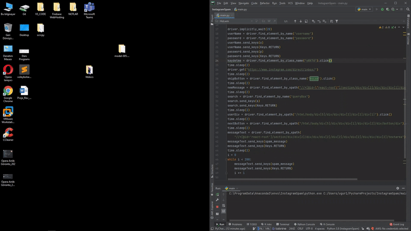

# Instagram Mesaj Spam

## Caution!
### **This project is purely for educational purposes. Please do not abuse**

## Usage
- Very easy to use, just enter the information below and start using
```python
u = "username" # Account Username
p = "password" # Account Password
s = "target username" # Target Username
spam_message = "message" # Message to be sent to the destination
```



### Developer By
##### Uğur Altınsoy

### Donate
```
BTC  : 1N7V3wX4xvGfwgBP1zQrcMSxohKKfiDxyH
ETH  : 0x0df6da87e219fb4854e933f1071ad91d17afa517
XRP  : rEb8TK3gBgk5auZkwc6sHnwrGVJH8DuaLh
DOGE : DKKmSHAa8GhAE5HNjmCXzkXPKTjpybY3mq
```

### Social
[](https://twitter.com/uguraltnsy)
[](https://www.instagram.com/ugur.altnsy)
[](https://www.linkedin.com/in/uğur-altınsoy/)
[](https://play.google.com/store/apps/developer?id=DeepLab&hl=tr)